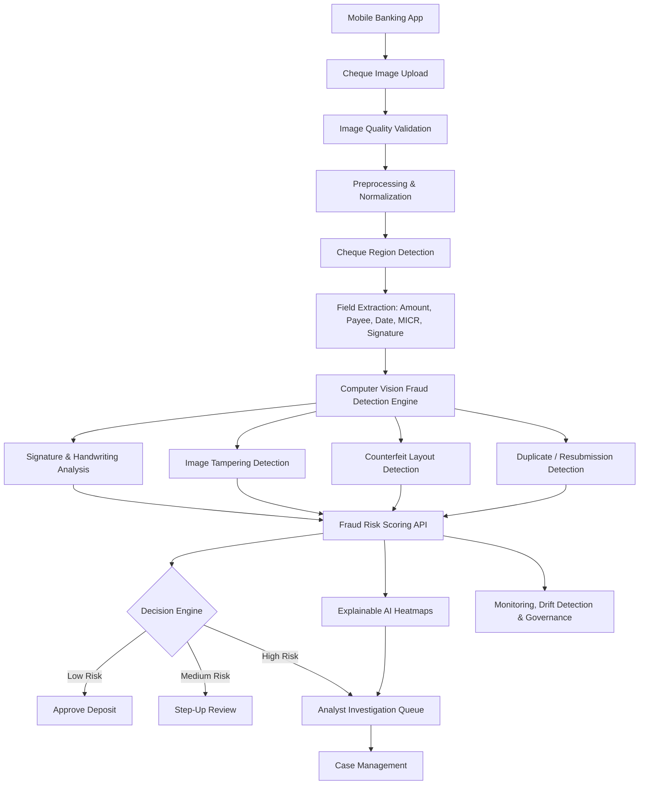

# Mobile Cheque Fraud Detection Architecture

## Component Description

The architecture begins when a customer submits a cheque image through a mobile banking application. The image quality validation layer checks focus, lighting, orientation, glare, cropping, and resolution. The preprocessing layer normalizes the cheque image using denoising, edge detection, perspective correction, grayscale conversion, contrast enhancement, and segmentation.

The cheque region detection layer identifies key areas such as amount, payee, date, MICR line, memo, signature, and endorsement. Computer vision models then evaluate visual inconsistencies, tampering artifacts, signature anomalies, handwriting inconsistencies, counterfeit layout indicators, and duplicate submission patterns.

The fraud risk scoring API generates a risk score and supporting reason codes. Low-risk deposits proceed automatically, medium-risk deposits may require additional validation, and high-risk deposits are routed to analysts for review.
